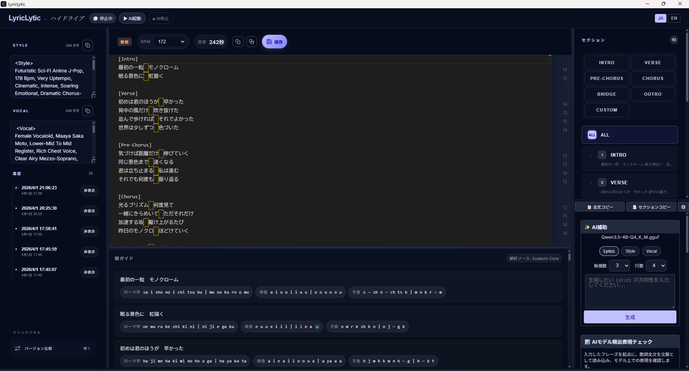

# LyricLytic


[日本語README](README.md)

LyricLytic is a desktop app for writing lyrics locally for AI music workflows.  
It keeps lyrics, BPM, rhyme guidance, AI assistance, snapshots, and diff comparison in one workspace.

As long as you follow the licenses of the software and models you use, the app is basically free to use.  
It is also structured in a way that makes local customization and modification easy.

- Local-first
- Direct `llama.cpp` startup
- UI focused on lyric writing
- Snapshot saving and diff comparison
- Rhyme guide with romanized / vowel / consonant views

## Screenshots

Actual runtime screenshots:



### When you launch it with no projects yet

This is the first screen you will see.  
Press `+ New Project` to begin.


### When you already have projects

Your existing projects appear as cards.  
Just click the one you want to open.


## What this app helps you do

- Keep Lyrics, Style, and Vocal notes together
- Organize lyrics by section
- Track BPM and estimated duration
- Check sound and rhyme patterns
- Generate Lyrics / Style / Vocal ideas with AI
- Save snapshots and compare versions later

## Main features

- Lyric editor
  - `ALL` view and section-based editing
  - add, reorder, and rename sections
  - BPM input and estimated duration
- Rhyme guide
  - reading analysis for Japanese lyrics, including kanji
  - romanized, vowel, and consonant views
  - easier end-sound comparison
- AI assistance
  - generate `Lyrics / Style / Vocal`
  - launch `llama.cpp` directly from LyricLytic
  - `Style / Vocal` are intended for English-oriented output
- Snapshots
  - store lyrics, Style, Vocal, and BPM together
  - compare versions later
- Deleted items
  - soft delete
  - restore
  - permanent delete

## Platform policy

- Windows is the primary supported OS
- macOS setup steps are provided
- macOS is implemented with launch support in mind, but I do not own a Mac, so I cannot guarantee it works
- In practice, real behavior is treated as the source of truth over old tests

## I want to use the AI features. What should I do?

At a high level, you only need these 4 steps:

1. Install `llama.cpp`
2. Download one model
3. Launch LyricLytic
4. Press `Start AI` and then `Connection Test`

The rest of this README explains the steps in order.

## What should I do first?

If this is your first time, just follow this order:

1. Install `llama.cpp`
2. Download one recommended model
3. Launch LyricLytic
4. Open `LLM Settings`
5. Set the path to `llama-server`
6. Set the path to your `.gguf` file
7. Press `Start AI`
8. Press `Connection Test`
9. Press `+ New Project` on the home screen
10. Start writing

It looks technical, but the number of things you actually need to touch is small.

## Quick start

### 1. Prerequisites

- Node.js 20 or later
- Rust / Cargo
- On Windows: WebView2 Runtime
- `llama.cpp`

### 2. Install `llama.cpp`

#### Windows

```powershell
winget install --id ggml.llamacpp --accept-package-agreements --accept-source-agreements
```

Typical `llama-server.exe` location:

```text
C:\Users\<your-user>\AppData\Local\Microsoft\WinGet\Packages\ggml.llamacpp_Microsoft.Winget.Source_8wekyb3d8bbwe\llama-server.exe
```

#### macOS

```bash
brew install llama.cpp
```

Typical `llama-server` location:

```text
/opt/homebrew/bin/llama-server
/usr/local/bin/llama-server
```

### 3. Download a model

Recommended models as of 2026-04-01:

1. Lightweight: `Qwen3.5-4B`
   - [Hugging Face](https://huggingface.co/unsloth/Qwen3.5-4B-GGUF?show_file_info=Qwen3.5-4B-UD-Q4_K_XL.gguf&library=llama-cpp-python)
2. Balanced: `Qwen3.5-9B`
   - [Hugging Face](https://huggingface.co/unsloth/Qwen3.5-9B-GGUF?show_file_info=Qwen3.5-9B-UD-Q4_K_XL.gguf)
3. Higher expression quality: `GPT-OSS-Swallow-20B`
   - [Hugging Face](https://huggingface.co/mmnga-o/GPT-OSS-Swallow-20B-RL-v0.1-gguf/blob/main/GPT-OSS-Swallow-20B-RL-v0.1-Q4_K_M.gguf)

Save the model as a `.gguf` file.

#### How to download it

1. Open one of the links above
2. Open the row for the model file you want
3. Confirm that the file ends with `.gguf`
4. Click `Download` or the down-arrow button
5. Save it somewhere easy to find

Your Downloads folder is fine for the first try.  
Later, you will point LyricLytic to that `.gguf` file.

#### Which file should I pick?

- Pick the exact filename shown in this README when possible
- Pick a file ending in `.gguf`
- Do **not** pick a file with `mmproj` in the name

If you are unsure, start with `Qwen3.5-4B`.

Notes:

- LyricLytic works best when you select the **GGUF file itself**, not just a folder
- Model licenses are defined by each model's distribution page

### 4. Launch LyricLytic

```powershell
npm install
npm run tauri:dev
```

On Windows, you can also use [Start.bat](Start.bat).

On macOS, `Start.bat` is not available.  
Open a terminal in the LyricLytic folder, then run:

```bash
cd /path/to/LyricLytic
npm install
npm run tauri:dev
```

### 5. First-time setup

Open `LLM Settings` from the `AI Assist` area and set:

- `llama.cpp executable path`
  - Windows: `llama-server.exe`
  - macOS: `llama-server`
- `Model file path`
  - your downloaded `.gguf`

Then press:

1. `Start AI`
2. `Connection Test`

At that point, you should be ready to try the AI features.

## Common points of confusion

### What goes into `llama.cpp executable path`?

Use `llama-server.exe` or `llama-server`.  
Do **not** put a `.gguf` file here.

### What goes into `Model file path`?

Use the `.gguf` file you downloaded.

### I pressed `Start AI` and nothing works

Check these two paths first:

- `llama.cpp executable path`
- `Model file path`

Most setup problems are one of these.

### I have no projects yet

That is fine.  
Just press `+ New Project` on the home screen.

## LLM settings in plain language

- Default timeout is 300 seconds
- `Max output tokens` starts high by default
- `Temperature` controls how wild or stable the wording becomes
  - lower = safer / more stable
  - higher = more variation / more surprise

## License

Licenses for the main software and dictionaries used by LyricLytic are listed in [THIRD_PARTY_LICENSES.md](THIRD_PARTY_LICENSES.md).

This includes:

- React
- Vite
- Tauri
- Rust
- SQLite
- Monaco Editor
- `llama.cpp`
- SudachiPy / SudachiDict-core

## If you get stuck

- If this README does not solve it, reply or DM [@rna4219 on X](https://x.com/rna4219)
- Support is planned for about six months after release
- Windows is the main supported environment
- macOS is designed to launch, but cannot be guaranteed because it has not been tested on an actual Mac

## More documentation

If you want deeper design or implementation details, check `docs/`.

- Documentation hub: [docs/project/HUB.codex.md](docs/project/HUB.codex.md)
- Main requirements: [docs/requirements/requirements.md](docs/requirements/requirements.md)
- Frontend requirements: [docs/requirements/frontend-requirements-v1.md](docs/requirements/frontend-requirements-v1.md)
- Rhyme guide spec: [docs/requirements/rhyme-analysis-v1.md](docs/requirements/rhyme-analysis-v1.md)
- Implementation entry: [docs/implementation/README.md](docs/implementation/README.md)
- Acceptance review: [docs/implementation/acceptance-review-20260401.md](docs/implementation/acceptance-review-20260401.md)
- Birdseye: [docs/BIRDSEYE.md](docs/BIRDSEYE.md)

## Repository structure

```text
LyricLytic/
├─ README.md
├─ README.en.md
├─ THIRD_PARTY_LICENSES.md
├─ Start.bat
├─ package.json
├─ src/
├─ src-tauri/
└─ docs/
```
