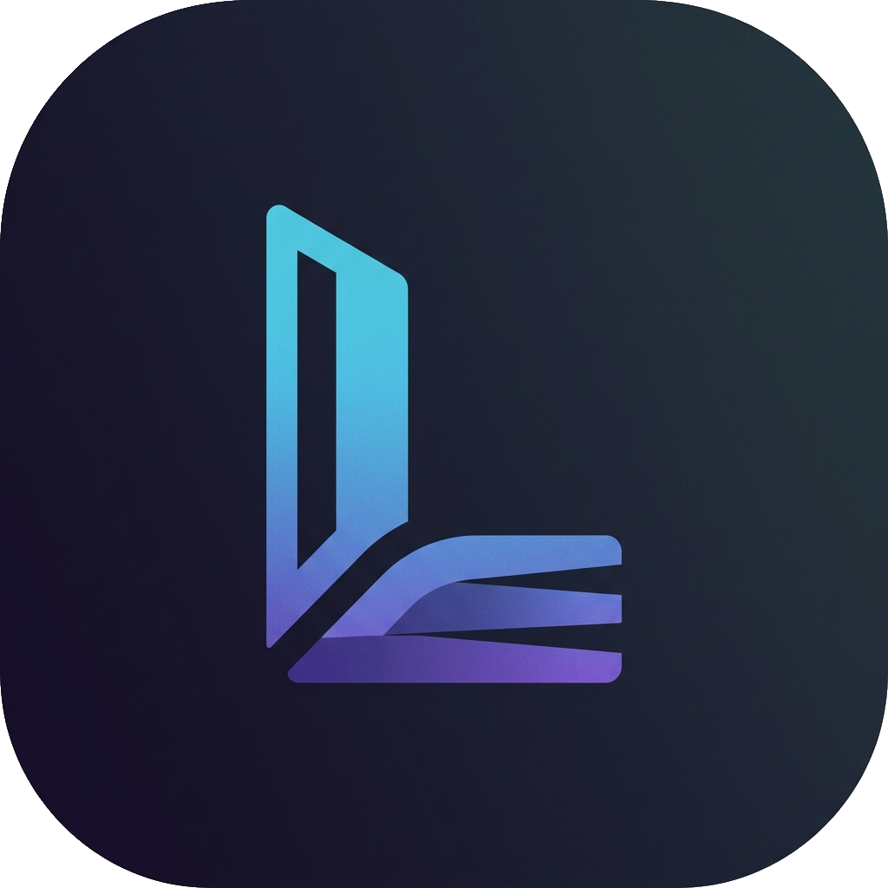
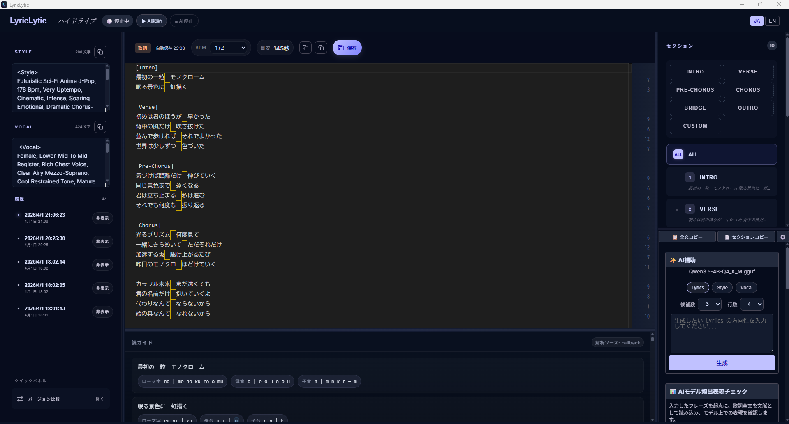

# LyricLytic



[English README](README.en.md)

LyricLytic は、AI 音楽生成向けの歌詞制作をローカルで完結させるためのデスクトップアプリです。  
歌詞本文、BPM、韻ガイド、AI補助、スナップショット保存、差分比較を 1 つのワークスペースで扱えます。

ライセンスに従う限り、AI機能含め基本的に無料で使えます。  
改造やローカル運用もしやすい構成です。

- ローカルファースト
- `llama.cpp` 直起動
- 歌詞制作に寄せた UI
- スナップショットと差分比較
- 韻ガイドによる母音 / 子音 / ローマ字の可視化

## 画面イメージ

実際の動作中画面です。



### 起動した直後にプロジェクトが無い場合

最初はこの画面になります。  
上の `+ 新規プロジェクト` を押せば始められます。


### 起動した直後にプロジェクトがある場合

前に使ったプロジェクトがカードで並びます。  
開きたいカードを押すだけです。


## このアプリでできること

- 歌詞・Style・Vocalをまとめられる
- セクションごとに整理する
- BPM を見ながら長さの目安を取る
- 韻ガイドで響きを確認する
- AI で Lyrics / Style / Vocal の案を出す
- スナップショット保存で後から差分比較する

## 主な機能

- 歌詞編集
  - `ALL` 表示とセクション単位編集
  - セクションの追加、並べ替え、改名
  - BPM 入力と目安秒数表示
- 韻ガイド
  - 漢字を含む日本語歌詞の読みを解析
  - ローマ字 / 母音 / 子音の確認
  - 行末の響きの比較
- AI補助
  - `Lyrics / Style / Vocal` の生成
  - `llama.cpp` を LyricLytic から直接起動
  - `Style / Vocal` は英語寄りの出力前提
- スナップショット
  - 保存時点の歌詞、Style、Vocal、BPM を保持
  - バージョン差分比較
- 削除済み管理
  - 論理削除
  - 復元
  - 完全削除

## 動作方針

- 主対応 OS は Windows
- macOS は導入手順のみ記載
- macOS は起動するように実装をしていますが、所持していないため、動作保証しかねます。
- テストより実機挙動を優先して運用しています

## AI補助機能を使いたいけど何をすればいい？

LyricLytic を使うには、ざっくり次の 4 つだけです。

1. `llama.cpp` を入れる
2. モデルを 1 つダウンロードする
3. LyricLytic を起動する
4. `AI起動` と `接続確認` を押す

以下に順番どおり書いています。

## まず何をすればいい？

初めてなら、この順番で大丈夫です。

1. `llama.cpp` を入れる
2. おすすめモデルを 1 つダウンロードする
3. LyricLytic を起動する
4. `LLM構成` を開く
5. `llama-server` の場所と `.gguf` を指定する
6. `AI起動` を押す
7. `接続確認` を押す
8. ホームで `+ 新規プロジェクト` を押す
9. 歌詞を書き始める

難しそうに見えても、実際に触る場所はかなり少ないです。

## クイックスタート

### 1. 前提ソフト

- Node.js 20 以上
- Rust / Cargo
- Windows の場合は WebView2 Runtime
- `llama.cpp`

### 2. `llama.cpp` を入れる

#### Windows

```powershell
winget install --id ggml.llamacpp --accept-package-agreements --accept-source-agreements
```

`llama-server.exe` の例:

```text
C:\Users\<ユーザー名>\AppData\Local\Microsoft\WinGet\Packages\ggml.llamacpp_Microsoft.Winget.Source_8wekyb3d8bbwe\llama-server.exe
```

#### macOS

```bash
brew install llama.cpp
```

`llama-server` の例:

```text
/opt/homebrew/bin/llama-server
/usr/local/bin/llama-server
```

### 3. モデルをダウンロードする

2026-04-01 時点でのおすすめモデルは次の 3 つです。

1. 軽さ優先: `Qwen3.5-4B`
   - [Hugging Face](https://huggingface.co/unsloth/Qwen3.5-4B-GGUF?show_file_info=Qwen3.5-4B-UD-Q4_K_XL.gguf&library=llama-cpp-python)
2. バランス型: `Qwen3.5-9B`
   - [Hugging Face](https://huggingface.co/unsloth/Qwen3.5-9B-GGUF?show_file_info=Qwen3.5-9B-UD-Q4_K_XL.gguf)
3. 表現力重視: `GPT-OSS-Swallow-20B`
   - [Hugging Face](https://huggingface.co/mmnga-o/GPT-OSS-Swallow-20B-RL-v0.1-gguf/blob/main/GPT-OSS-Swallow-20B-RL-v0.1-Q4_K_M.gguf)

モデルは `.gguf` ファイルで保存してください。

#### ダウンロードのしかた

1. 上のリンクを開く
2. 欲しいモデル名の行を開く
3. `.gguf` ファイル名を確認する
4. `Download` か `↓` のボタンを押す
5. 分かりやすい場所に保存する

最初は `ダウンロード` フォルダでも大丈夫です。  
あとで LyricLytic の `モデルファイルパス` でその `.gguf` を選びます。

#### どのファイルを選べばいい？

- 基本は README に書いてあるファイル名そのものを選んでください
- 拡張子が `.gguf` のファイルを選んでください
- `mmproj` という名前のファイルは選ばないでください

迷ったら、まずは一番軽い `Qwen3.5-4B` から始めるのがおすすめです。

補足:

- LyricLytic はフォルダではなく **GGUF ファイルそのもの** を指定する使い方が一番確実です
- モデル本体のライセンスは各配布ページの記載に従ってください

### 4. LyricLytic を起動する

```powershell
npm install
npm run tauri:dev
```

Windows では [Start.bat](Start.bat) でも起動できます。

macOS では `Start.bat` は使えません。  
LyricLytic のフォルダをターミナルで開いてから、次を実行してください。

```bash
cd /LyricLytic を置いた場所/LyricLytic
npm install
npm run tauri:dev
```

### 5. 最初の設定

右下の `AI補助` から `LLM構成` を開き、次を設定します。

- `llama.cpp 実行ファイルパス`
  - Windows: `llama-server.exe`
  - macOS: `llama-server`
- `モデルファイルパス`
  - ダウンロードした `.gguf`

その後、

1. `AI起動`
2. `接続確認`

の順で進めてください。

ここまでできれば、すぐに AI補助機能を試せます。

## 迷いやすいポイント

### `llama.cpp 実行ファイルパス` には何を入れる？

`llama-server.exe` または `llama-server` です。  
`.gguf` ファイルではありません。

### `モデルファイルパス` には何を入れる？

ダウンロードした `.gguf` ファイルそのものです。

### `AI起動` を押しても動かない

次の 2 つを見直してください。

- `llama.cpp 実行ファイルパス`
- `モデルファイルパス`

ほとんどの場合、このどちらかです。

### プロジェクトが無い

問題ありません。  
ホームの `+ 新規プロジェクト` を押せばすぐ始められます。

## LLM 設定の考え方

- `タイムアウト` の既定値は 300 秒
- `最大出力トークン` は大きめから始める
- `Temperature` は文章のばらつきの強さ
  - 低いほど安定
  - 高いほど遊びが増える

## ライセンス

主要ソフトウェアと辞書のライセンスは [THIRD_PARTY_LICENSES.md](THIRD_PARTY_LICENSES.md) にまとめています。

含まれる主な項目:

- React
- Vite
- Tauri
- Rust
- SQLite
- Monaco Editor
- `llama.cpp`
- SudachiPy / SudachiDict-core

## 困ったとき

- README で解決しない場合は、X の [@rna4219](https://x.com/rna4219) にリプライやDMを飛ばしてください
- リリースから3カ月 (2026/07/01) まではサポート予定です
- Windows が主対応です
- macOS は起動するように実装をしていますが、所持していないため、動作保証しかねます。

## 詳しいドキュメント

詳しい設計や仕様は `docs/` にあります。

- ドキュメントハブ: [docs/project/HUB.codex.md](docs/project/HUB.codex.md)
- 正本要件: [docs/requirements/requirements.md](docs/requirements/requirements.md)
- フロントエンド要件: [docs/requirements/frontend-requirements-v1.md](docs/requirements/frontend-requirements-v1.md)
- 韻ガイド仕様: [docs/requirements/rhyme-analysis-v1.md](docs/requirements/rhyme-analysis-v1.md)
- 実装入口: [docs/implementation/README.md](docs/implementation/README.md)
- 検収レビュー: [docs/implementation/acceptance-review-20260401.md](docs/implementation/acceptance-review-20260401.md)
- Birdseye: [docs/BIRDSEYE.md](docs/BIRDSEYE.md)

## リポジトリ構成

```text
LyricLytic/
├─ README.md
├─ THIRD_PARTY_LICENSES.md
├─ Start.bat
├─ package.json
├─ src/
├─ src-tauri/
└─ docs/
```
