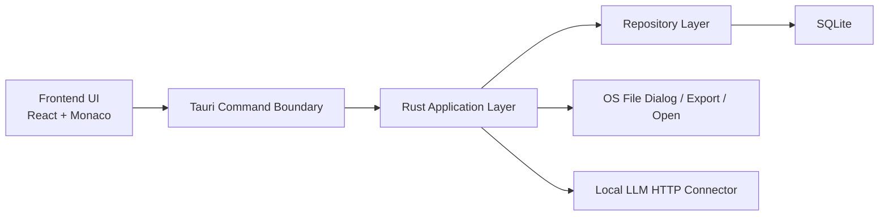

# LyricLytic システム構成 v1

## 1. 構成方針

LyricLytic PoC は、`Tauri shell + Web フロントエンド + Rust アプリ層 + SQLite 永続化` の 4 層で構成する。



## 2. 層ごとの責務

### 2.1 Frontend UI

責務:

- 画面表示
- 入力状態管理
- エディタ表示
- ダイアログ開閉
- エラーとローディング表示

持たない責務:

- SQLite 直接アクセス
- OS ファイル操作
- 外部 URL オープン
- ローカル LLM HTTP 通信の詳細

### 2.2 Tauri Command Boundary

責務:

- UI からの要求を明示的な command として受ける
- 入出力 JSON を固定する
- 例外や I/O 失敗を UI 向けのエラーへ変換する

原則:

- `command 名は動詞起点`
- `1 command = 1 ユーザー意図`
- `UI に DB スキーマを漏らしすぎない`

### 2.3 Rust Application Layer

責務:

- ドメインルール適用
- 論理削除バッチ制御
- Working Draft と LyricVersion の整合維持
- エクスポート組み立て
- LLM レスポンス検証

### 2.4 Repository Layer

責務:

- SQLite クエリ
- マイグレーション適用
- active / deleted の既定フィルタ
- transaction 境界

原則:

- UI や command 層に SQL を漏らさない
- `deleted_at IS NULL` を active 既定とする
- バッチ操作は transaction で閉じる

## 3. 推奨ディレクトリ構成

```text
LyricLytic/
├─ src/
│  ├─ app/
│  ├─ pages/
│  ├─ features/
│  │  ├─ projects/
│  │  ├─ editor/
│  │  ├─ versions/
│  │  ├─ fragments/
│  │  ├─ song-artifacts/
│  │  ├─ deleted-items/
│  │  └─ settings/
│  ├─ components/
│  ├─ lib/
│  └─ styles/
├─ src-tauri/
│  ├─ src/
│  │  ├─ commands/
│  │  ├─ application/
│  │  ├─ repositories/
│  │  ├─ db/
│  │  ├─ export/
│  │  ├─ llm/
│  │  └─ errors/
│  └─ migrations/
└─ docs/
```

## 4. ドメイン単位の責務分割

### 4.1 projects

- Project 一覧
- Project 作成
- Project 選択
- Project 論理削除

### 4.2 editor

- Working Draft 表示
- draft_sections 編集
- 自動保存
- 保存状態表示

### 4.3 versions

- Save Snapshot
- LyricVersion 一覧
- 差分比較
- 復元

### 4.4 fragments

- 断片一覧
- TXT インポート
- 断片挿入
- used / unused 状態更新

### 4.5 song-artifacts

- LyricVersion 紐付け
- URL / file path 管理
- 外部 URL オープン確認

### 4.6 deleted-items

- バッチ一覧
- 復元
- 復元不可理由表示

## 5. 永続化上の注意

- `working_drafts` は 1 Project につき active 1 件
- `style_profiles` も 1 Project につき active 1 件
- `draft_sections` を PoC の編集正本とする
- `latest_body_text` は全文コピーや表示最適化の派生値とみなす

## 6. 非同期処理の扱い

同期感が欲しい UI でも、以下は非同期として扱う。

- DB 初期化
- 自動保存
- Save Snapshot
- 差分ロード
- TXT インポート
- エクスポート
- LLM 接続確認
- LLM 補助実行

UI は、各処理の `loading / success / error` を個別に区別できる必要がある。

## 7. 実装境界の原則

- フロントエンドは `Working Draft 主体` を表示で保証する
- Rust 側は `履歴破壊をしない` をルールで保証する
- SQLite は `active 1 件` と `論理削除両立` を index で補強する
- LLM 連携は `JSON schema 不一致なら失敗` を保証する
