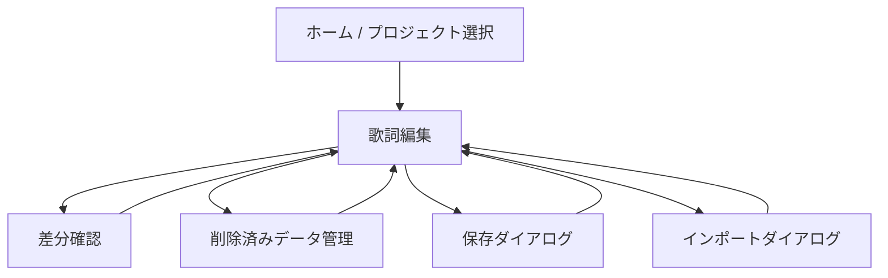

# LyricLytic 画面遷移・操作フロー案 v1

## 1. 目的

本書は、`requirements.md` の機能要件と保存モデルを、実際の画面遷移と主要操作フローへ落とし込むための設計たたき台である。  
特に、Working Draft、LyricVersion、論理削除、断片挿入、曲紐付けの整合を UI 観点で確認する。

## 2. 主要画面一覧

MVP で最低限必要な画面は以下とする。

1. ホーム / プロジェクト選択画面
2. 歌詞編集画面
3. 差分確認ビュー
4. 削除済みデータ管理画面
5. 保存ダイアログ
6. インポートダイアログ

`requirements.md` にある 3 画面構成だけでは、起動直後導線、論理削除の復元導線、保存時メタ情報入力が不足するため、上記を追加前提とする。  
ただし、曲紐付け、検索、断片一覧、StyleProfile 編集、履歴参照は独立画面へ切り出さず、歌詞編集画面内の補助面として扱う。

## 3. 全体画面遷移

## 4. 主要操作フロー

### 4.1 初回起動から編集開始

1. アプリ起動
2. ホーム / プロジェクト選択画面を表示
3. 既存 Project があれば一覧表示、なければ空状態 UI を表示
4. ユーザーは `新規 Project 作成` または `既存 Project を開く`
5. Project を開いたら歌詞編集画面へ遷移
6. 当該 Project に Working Draft があれば復元して表示、なければ空 Draft を作成
7. 空 Draft の場合、セクションは未配置のままとし、プリセットは `追加候補` として提示する

### 4.2 編集中の自動保存

1. ユーザーが歌詞編集画面で本文またはセクションを編集
2. 一定条件で Working Draft と draft_sections を保存
3. 保存失敗時はエラー通知を出し、再試行導線を出す
4. 保存成功時は明示的なモーダルは出さず、非侵襲の保存状態表示に留める

### 4.3 スナップショット保存

1. ユーザーが `保存` を実行
2. 保存ダイアログを表示
3. `snapshotName` と任意メモを入力
4. 現在の Working Draft を元に LyricVersion と version_sections を新規作成
5. 保存後も編集画面には残り、作業継続対象は Working Draft のままとする

この仕様により、`保存` は履歴版を増やす操作であり、編集対象を version 固定に切り替える操作ではない。

### 4.4 過去版からの復元

1. 歌詞編集画面または差分確認画面から過去の LyricVersion を選択
2. `この版から作業を再開` を選ぶ
3. 現在の Working Draft を確認のうえで置き換える
4. 選択した LyricVersion の内容を基に新しい Working Draft / draft_sections を再構成
5. 歌詞編集画面へ戻る

この仕様により、過去版復元は既存 LyricVersion の破壊的更新ではなく、Working Draft の再構築として扱う。

### 4.5 差分確認

1. 歌詞編集画面から `差分確認` を開く
2. 比較元 / 比較先の LyricVersion を選ぶ
3. 差分確認画面で Diff Editor を表示
4. 必要に応じて `この版から作業を再開` または編集画面へ戻る

### 4.6 断片インポートと挿入

1. 歌詞編集画面から `断片インポート` または `断片一覧` を開く
2. テキストファイルまたは手動入力で CollectedFragment を追加
3. 断片一覧で対象断片を選択
4. `本文へ挿入` を実行
5. 現在フォーカス中のセクションまたは選択位置へ反映
6. 必要に応じて fragment status を `used` へ更新

### 4.7 曲紐付け

1. 歌詞編集画面から `曲紐付け` を開く
2. 右サイドインスペクタ内で対象 LyricVersion を確認
3. URL またはローカルファイルを入力
4. 曲タイトル、評価メモ、プロンプトメモを入力
5. SongArtifact を保存
6. 編集画面内で一覧更新し、文脈を維持する

### 4.8 検索

1. 歌詞編集画面で `検索` を開く
2. 検索パネルまたはドロワーを表示
3. `本文 / 過去版 / 断片 / タグ` の種別を切り替える
4. 検索語を入力し、結果一覧を表示
5. 対象を選択すると、現在の編集コンテキストを維持したまま該当位置または該当データへ移動する

### 4.9 論理削除と復元

1. ユーザーが Project、LyricVersion、SongArtifact、CollectedFragment、RevisionNote、StyleProfile などの削除を実行
2. 確認ダイアログを表示
3. 実際には `deleted_at` を付与し、通常一覧から除外
4. 削除済みデータ管理画面で対象を確認
5. `復元` 実行で `deleted_at` を解除

LyricVersion の削除も論理削除で扱うが、履歴整合に与える影響が大きいため、UI 上では特に強い注意表示を要する。

## 5. 画面別要件補足

### 5.1 ホーム / プロジェクト選択画面

- Project 一覧を表示する
- 新規 Project 作成導線を持つ
- 最終更新順で並べ替えできることが望ましい
- 削除済み Project は通常一覧に表示しない

### 5.2 歌詞編集画面

- Working Draft が主対象であることを UI 上で識別できること
- 直近保存済みの LyricVersion 名を参照できること
- セクション一覧、本文、断片、メモ、曲への導線を持つこと
- 現在の編集対象が Draft であることと、履歴版が別物であることを混同させないこと
- 空 Draft から開始できることと、セクションプリセットは追加候補であることを UI で理解できること
- 検索 UI と StyleProfile 編集 UI は編集画面から離脱せず開けること
- 曲紐付け、履歴参照、断片参照も可能な限り編集画面内で完結させること
- 左ナビゲーション / 中央主作業 / 右インスペクタの 3 ペイン構成を基本とすること

### 5.3 保存ダイアログ

- snapshotName 入力欄
- 任意メモ入力欄
- 保存後のふるまい説明

### 5.4 削除済みデータ管理画面

- Project 単位で削除済みデータを絞り込めること
- 種別ごとに復元できること
- 物理削除は MVP では露出しないこと
- StyleProfile も削除済み対象として扱えること
- 主作業導線ではなく、Settings 配下または深い階層に置くこと

## 6. UI フローから見つかった要件上の論点

1. `3画面構成` だけでは足りず、ホーム画面、削除済み管理画面、保存ダイアログが必要
2. 保存後も編集対象は Working Draft のままであることを明記しないと、Version 編集と混同しやすい
3. 過去版復元は `LyricVersion の復元` ではなく `Working Draft の再構築` として扱う方が破綻しにくい
4. 論理削除を採る以上、削除済みデータ一覧と復元導線は MVP 必須に近い
5. Working Draft が主対象であることを UI 上で明示しないと、履歴モデルの理解が破綻しやすい
6. 曲紐付けや検索を独立画面に寄せすぎると、創作ワークスペースの統一感が崩れやすい

## 7. 次に要件へ戻すべき項目

- ホーム / プロジェクト選択画面の追加
- 削除済みデータ管理画面の追加
- 保存ダイアログの追加
- 保存後に編集対象が Working Draft のままであることの明文化
- 復元フローを `Draft 再構築` として明文化
